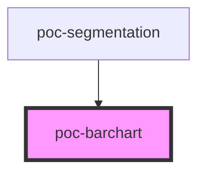

# poc-barchart

<!-- Auto Generated Below -->

## Properties

| Property | Attribute | Description | Type     | Default     |
| -------- | --------- | ----------- | -------- | ----------- |
| `perc1`  | `perc-1`  |             | `number` | `undefined` |
| `perc2`  | `perc-2`  |             | `number` | `undefined` |
| `perc3`  | `perc-3`  |             | `number` | `undefined` |
| `value1` | `value-1` |             | `number` | `undefined` |
| `value2` | `value-2` |             | `number` | `undefined` |
| `value3` | `value-3` |             | `number` | `undefined` |

## Dependencies

### Used by

 - [poc-segmentation](../poc-segmentation)

### Graph

----------------------------------------------

*Built with [StencilJS](https://stenciljs.com/)*
