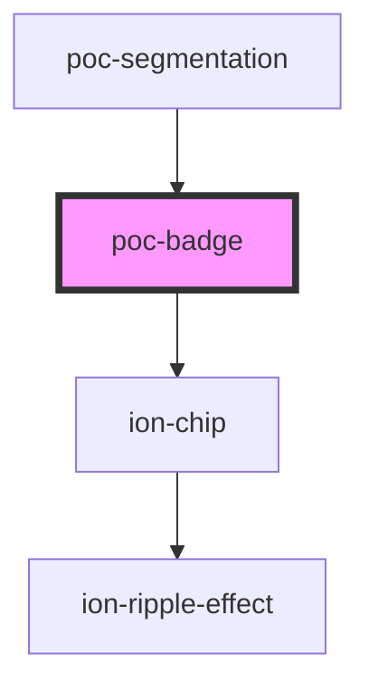

# poc-badge

<!-- Auto Generated Below -->

## Properties

| Property | Attribute | Description | Type                   | Default     |
| -------- | --------- | ----------- | ---------------------- | ----------- |
| `color`  | `color`   |             | `string`               | `undefined` |
| `type`   | `type`    |             | `"error" \| "success"` | `undefined` |

## Dependencies

### Used by

 - [poc-segmentation](../poc-segmentation)

### Depends on

- ion-chip

### Graph

----------------------------------------------

*Built with [StencilJS](https://stenciljs.com/)*
