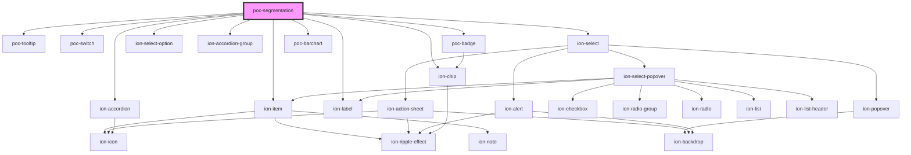

# poc-segmentation

<!-- Auto Generated Below -->

## Properties

| Property | Attribute | Description | Type     | Default     |
| -------- | --------- | ----------- | -------- | ----------- |
| `auth`   | `auth`    |             | `string` | `undefined` |

## Dependencies

### Depends on

- [poc-tooltip](../tooltip)
- [poc-switch](../poc-switch)
- ion-item
- ion-select
- ion-select-option
- ion-accordion-group
- ion-accordion
- [poc-badge](../poc-badge)
- ion-chip
- ion-label
- [poc-barchart](../bar-chart)

### Graph

----------------------------------------------

*Built with [StencilJS](https://stenciljs.com/)*
