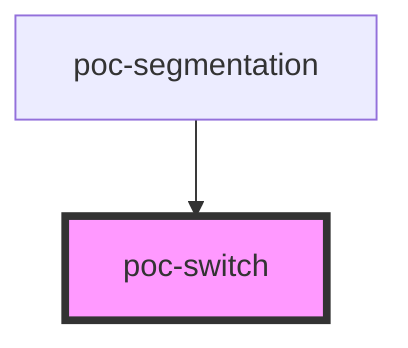

# poc-switch

<!-- Auto Generated Below -->

## Properties

| Property     | Attribute | Description | Type                             | Default     |
| ------------ | --------- | ----------- | -------------------------------- | ----------- |
| `leftValue`  | --        |             | `{ label: string; value: any; }` | `undefined` |
| `rightValue` | --        |             | `{ label: string; value: any; }` | `undefined` |
| `value`      | `value`   |             | `any`                            | `undefined` |

## Events

| Event     | Description | Type                                          |
| --------- | ----------- | --------------------------------------------- |
| `toggled` |             | `CustomEvent<{ label: string; value: any; }>` |

## Dependencies

### Used by

 - [poc-segmentation](../poc-segmentation)

### Graph

----------------------------------------------

*Built with [StencilJS](https://stenciljs.com/)*
